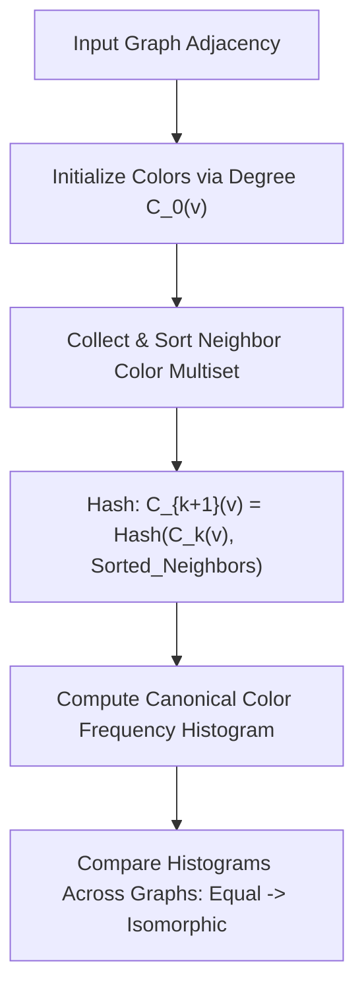

# genpark-weisfeiler-lehman-graph-isomorphism-skill

Agent Skill implementing the **1-Dimensional Weisfeiler-Lehman (1-WL) Graph Coloring Isomorphism Kernel**, identifying topological equivalence and graph invariants.

## Architectural Overview

